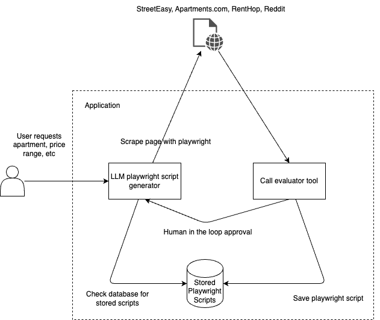

# Broker Agent

✨ Key Capabilities:
1. **Market Analysis**: Get up-to-date analysis about the NYC rental market
2. 🔍 **Smart Apartment Search**: Scrape the web search for apartments and filter by user criteria
3. 📊 **Applicant Mode**: The agent will fill out apartment applications and apply for you

🚀 What makes us unique? Broker Agent runs entirely on local models, leveraging the power of [Ollama](https://ollama.com/) for lightning-fast LLM inference. This means superior performance, complete privacy, and no dependency on external API services.

## 🎥 Demo Video

## Quickstart
### Setting up the Environment
To set up the environment, follow the `.env.example` file found in the root and frontend directories. Fill in the missing values, with the connection strings for the LLM servers and databases.

#### Running the Application
If running outside the containers, start the frontend and backend as follows. Otherwise, skip to the Docker section.

#### Installing Dependencies
To install the dependencies, run the following command:
```bash
poetry install

# Install playwright dependencies
playwright install # This will install the playwright browser and dependencies
```

#### Start the Frontend
To start the frontend, run:
```bash
cd frontend
pnpm install
pnpm run prisma:generate
pnpm run dev
```

#### Start the Backend
To start the backend, run:
```bash
poetry install
poetry run uvicorn backend.app.main:app --reload --port 9090
```

### Run the Application
To run the application, navigate to the root directory and run:
```bash
docker-compose -f docker-compose.yml up -d --build
```
This will start up all the containers required to run the application.

### Run the Scraper
To run the scraper, use the Poetry script. Make sure playwright is installed in the python environment.
```bash
poetry run scrape
```

#### Running in headful mode
To run the scraper in headful mode, set the `HEADLESS_BROWSER` environment variable to `False` in the `.env` file.
```bash
HEADLESS_BROWSER=False poetry run scrape
```
Note that on linux systems, you will need to run with xvfb to run the scraper in headful mode.
```bash
xvfb-run -a poetry run scrape
```

## 🏗️ Architecture


### Data Layer
Broker agent is designed for RAG from the ground up, splitting the database layer into a both a vector database and a relational database. The vector database is used for storing the embeddings and the relational database is used for storing the metadata.

## 🔧 Behind the Scenes
Significant effort was required at the hardware and networking levels to get the application running. In particular, I needed a machine capable of running a 70B parameter LLM and a network to allow my application to access the server securely. I created the network between my sever and development machines with the [Tailscale Network](https://tailscale.com/).

### 🖥️ Building an LLM Inference Server
LLMs are possible to run with consumer hardware! Given 2 32GB VRAM GPUs, I was able to run a 70B parameter LLM with strong performance for this app! It required building a custom server with a 1600W power supply, 2 RTX 3090 GPUs, and 128 GB of RAM to handle the model weights for training and inference.


## 📚 Documentation
- FastAPI OpenAPI Documentation: Access the interactive API docs at `/docs` or `/redoc` when running the server

### 🤖 LLM Integration
- [Ollama Documentation](https://github.com/ollama/ollama/blob/main/docs/api.md)
- [Langchain Documentation](https://python.langchain.com/docs/get_started/introduction)
- [RAG Best Practices](https://www.pinecone.io/learn/retrieval-augmented-generation/)

### 📖 Sphinx Documentation
- API reference documentation is available in the `docs/` directory
- Build the documentation by running `poetry run docs` in the root directory or by running `make html` in the `docs/` directory
- View the built documentation at `docs/_build/html/index.html`
- [Sphinx Documentation](https://www.sphinx-doc.org/en/master/)


## Prerequisites
- Docker
- Docker Compose
- An LLM server with support for Ollama for vLLM
- Playwright (install with `playwright install`)

## Getting Started

### Clone the Repository

### Installing Dependencies

#### Frontend Dependencies

#### Backend Dependencies

#### Pre-commit Hooks
This project uses pre-commit hooks to ensure code quality and consistency. To install the pre-commit hooks, run the following command:
```bash
poetry run pre-commit install
```

#### Ollama
To leverage [Ollama](https://ollama.com/) for LLM inference, install the required models. Do this by running the following command:
```bash
sudo apt-get install -y ollama
ollama pull model_name
ollama serve
```
Download `llama3.1` and `nomic-embed-text` models to get started, change the `backend/app/config/config.yml` file to use different LLMs. Use the `ollama_` prefix in the config file to tell the application to use Ollama.

#### Running Ollama on the LLM Inference Server
To run Ollama on the LLM inference server, run the following command:
```bash
sudo apt-get install -y ollama
ollama pull model_name

# Now edits the service file to use the ollama server over the network
sudo systemctl edit ollama.service
# Add the Environment Variable: In the editor, add the following lines under the [Service] section:
# Environment="OLLAMA_HOST=0.0.0.0"
sudo systemctl daemon-reload
sudo systemctl restart ollama

ollama serve
```

#### vLLM
To leverage [vLLM](https://github.com/vllm-project/vllm) for LLM inference, install vLLM dependencies in the python environment and start the server with the following commands:
```bash
conda create -n vllm python=3.10
conda activate vllm
pip install vllm # Note that pip should be used instead of conda to avoid low-level dependency resolution issues

# This is an example command, tweak the parameters as needed for the available hardware
vllm serve meta-llama/Llama-3.1-8B-Instruct --dtype bfloat16 --max_model_len 4096 --tensor_parallel_size 2 --chat-template tool_chat_template_llama3.1_json.jinja --tool-call-parser llama3_json --enable-auto-tool-choice --port 8000
```

Here is another example command to use Mistral instead of Llama:
```bash
vllm serve mistralai/Mistral-7B-Instruct-v0.3 --dtype bfloat16 --max_model_len 4096 --tensor_parallel_size 2 --tokenizer_mode "mistral"
```

Feel free to experiment with different underlying models! The model choice is fully configurable in the `backend/app/config/config.yml` file.

Note that vLLM requires significantly more VRAM for a given number of model weights due to its sophisticated paged attention caching system. This makes its inference incredibly efficient in parallel, but may reduce the maxiumum parameter cound (and therefore intelligence) of the model hosted.

## Testing

### Running the tests
The application uses pytest to run the test suite. To run the tests, navigate to the root directory and run:
```bash
poetry run pytest -v -s
```
Under the hood, the tests use [Deep Eval](https://docs.confident-ai.com/) to check the LLM responses. The built-in Deep Eval RAGAS metrics are particularly useful for evaluating the model's performance on the RAG questions.

#### Notes on testing
- The test suite is strongly limited by compute resources, meaning that the number of tests that can be run is limited by the available hardware
- The test suite relies heavily on the LLM-as-a-judge paradigm, meaning that the tests are susceptible to the LLM's capabilities
- The tests are also susceptible to the quality of the test data, which is why I included a few tests that were explicitly designed to be difficult for the LLM to answer
- The tests cases are synthetic data generated through a separate synthetic data pipeline

## Contributing

Contributions are welcome! If you have any ideas or suggestions, please feel free to open an issue or submit a pull request.

## References
- [LangGraph](https://www.langchain.com/langgraph)
- [Ollama + LangGraph](https://www.youtube.com/watch?v=Nfk99Fz8H9k)
- [vLLM](https://github.com/vllm-project/vllm)
